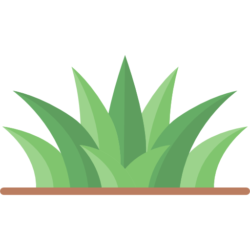
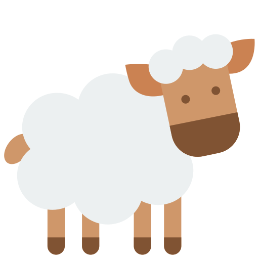

# Game of Life
Virtual world simulation program, which has a two-dimensional lattice structure with an interface specified by the user. 
In this world rules simple forms of life with different behavior. 
Each field of game board can contain at most one organism (collision, one of them is removed or moved).
The simulator is turn-based. 
Each turn, all organismsperform activities appropriate to their type on an ongoing basis. 

Some of them are moving (animals), part is stationary (plants). 
In the event of a collision one of the organisms wins by killing (e.g. wolf), escaping (antelope) or reflecting the attack (turtle). 
The order in which organisms function in a turn depends on their initiatives. 
The animals that have the highest initiative move first. In the case of animals of the same initiative with the correct seniority rule (the longer living moves earlier). 
Winning a meeting depends on the body's strength. 
Specific type of organism is Human.
As a result to animals, man does not move in a random way. 

The direction of his movement is determined by the keys before several turns keyboard arrows.
A man who also has the ability (immortality) of which can be activated individually. 
Activation remains active for 5say turn, after which it refers to its deactivation.
After the skill is deactivated, it cannot be activated before damage 5 turns.

# Controls
#### ENTER -> next tour

#### SPACE -> special ability

#### ARROWS -> movement

#### LEFT MOUSE BUTTON -> select organism / place organism on grid

# Display

  

# Organisms stats
| Organism                                                            | Name   | Strength | Initiative | Action                      | Collision                                                                      |
| :-----------------------------------------------------------------  | :----   | :------- | :--------- | :-------------------------  | :----------------------------------------------------------------------------- |                                                     
|    | Antelope | 4        | 4          | Movement range is 2 fields.  | 50% chance to escapebefore the fight. Then moves to unoccupied adjacent field. |
|  | Belladonna | 99       | 0          | None.                        | The animal that atethis plant dies.|
|          | Cyber Sheep| 11       | 4          | None.                        | Its primary goal issosnowsky's hogweed extermination Always directs towards the nearest one and tries to eat it. If there is none on the boardborscht pretends to be ordinary sheep.|
|    | Dandelion |0        | 0          | tries to spread 3 times.     | None. |
|                | Fox | 3        | 7          | will never move to the field occupied by stronger than him | None |
|            | Grass | 0        | 0          | None.  | None. |
|        | Guarana | 0        | 0          | None.  | Increases strength of animal which ate this plant by 3. |
|            | Human | 5        | 4          | Keyboard control.  | Has special ability. Immortality, lasts for 5 tours. |
|            | Sheep | 4        | 4          | None.  | None. |
|    | Sosnowsky's Hogweed| 10       | 0          | It kills animals that surrounds it, except of cyber sheep. | The animal that ate this onethe plant dies. Only a cyber sheep does not. |
|          | Turtle | 2        | 1          | In 75% of cases, decides to take a break. | Reflects attacks of animals below strength < 5. The attacker mustgo back to his previous field. |
|              | Wolf | 9        | 5          | None.  | None. |

## Author
MikyTuberr / Piotr

Email: pio1342@gmail.com
## Bug Reports
Please contact pio1342@gmail.com to repurt any bugs errors, or typos
## License
This project is licensed under the Apache License Version 2.0, See the LICENSE file for more information.

